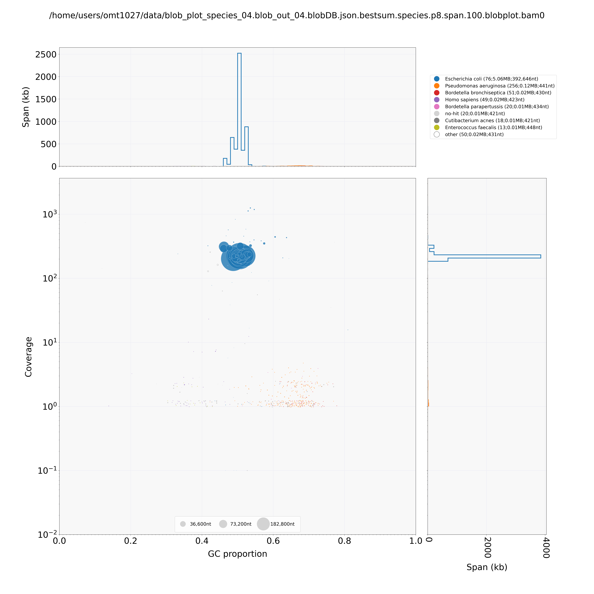
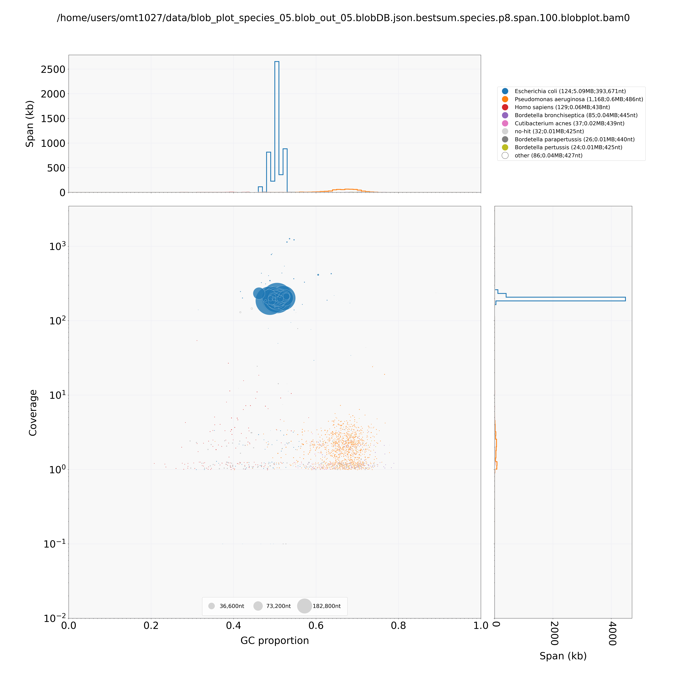
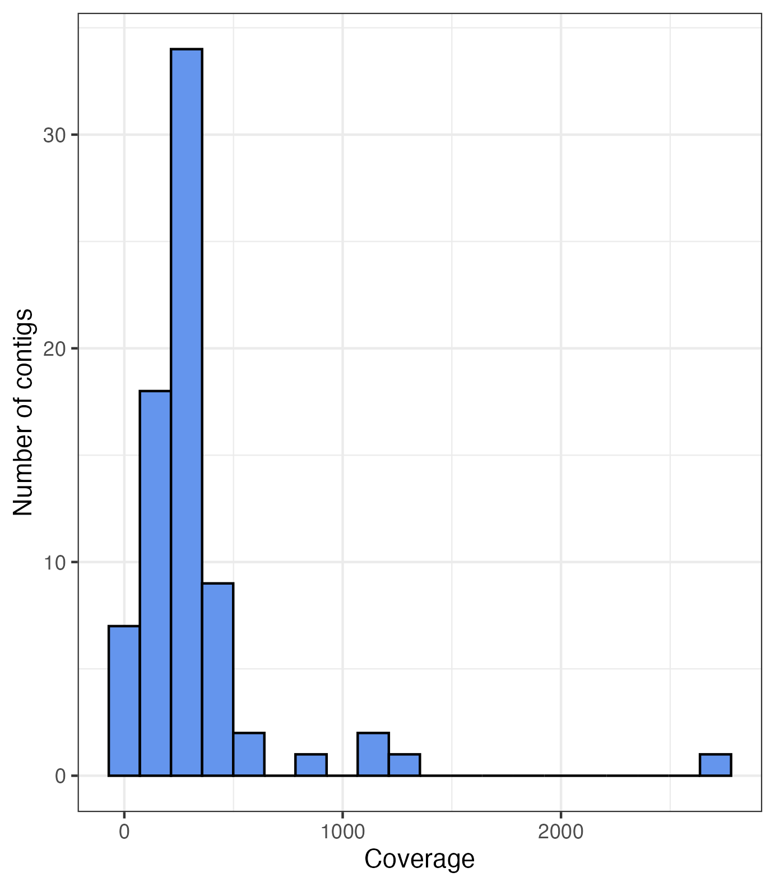
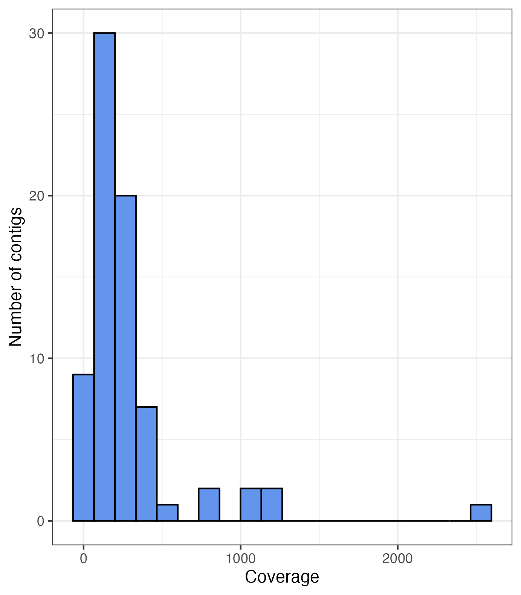

### Gen 711 Final Project
Author: Olivia Tatro

# Assembly and Identififcation of Mystery Bacteria Genomes 
Goals: 
1. Create a shell script that assembles both bacterial genomes using loops
2. Identify the species
3. Create visualizations of the genomes and phylogeny 

# Background
- The data are in 4 .fastq files, containing the forward and reverse raw 250bp Illumina reads for two different mystery bacteria.
- The goal is to use these files to do a de novo genome assembly, annotate the genome, and identify the bacteria species. 

# Methods
Input data: the initial data is from samples of unknown bacteria species. They are 250bp long paired-end reads from the Illumina sequencer in fastq file format. 

**FastQC** 
This program takes the forward and reverse reads for a sample and summarizes the base-call qualities. It produced plots that show the base-call qualities, which were in an HTML report that included GC content, the total number of sequences, and the total number of bases.

**Trimmomatic**
Trimmomatic took the forward and reverse reads and trimmed the poor quality parts of the reads off to create better quality reads. Typically, the ends of raw reads have lower base-call quality. Trimmomatic output trimmed reads in the .fastq file format. I called this program through the trim_scriptV2.sh wrapper script on the UNH ron teaching server. 

**FastQC**
At this point in the pipeline, I ran FastQC again on the trimmed reads from Trimmomatic. 

**SPAdes**
This program assembled the raw reads into contigs. So, it took trimmed reads (forward, reverse, paired, and unpaired) in the format of .fastq, and the output was labelled contigs in .fasta file format. SPAdes uses De Bruijin Graphs where each node is a kmer, and the kmers are different sizes. 

**QUAST**
QUAST took the contigs.fasta file (output from SPAdes) and generated reports on the contiguity of the genome in various formats. These reports include the number of contigs, largest contig, Contig N50, GC content, and total length in base pairs. 

**BUSCO**
BUSCO assessed the completeness of the genome assembly. It does this by comparing how many core genes are present in the assembly to the amount of core genes in broad taxonomic groups. The input to this program is the contigs.fasta file from SPAdes, and it also requires specifying that this project has a genome assembly and it is a bacterium. The output is summary sheets and tables of the results. 

**PROKKA**
This program annotated the assembled genome. It takes the contigs.fasta file as input and allows you to specify the minimum contig length. It outputs several different files, one of which is a genome feature file (.gff), and ffn and fna files for nucleotides and amino acid sequences. Basicaly, this program predicts the genes in the assembly and annotates them by function based on a reference database. 

**BLAST**
This is the Basic Local Alignment and Search Tool. This is a powerful program that allows you to "blast" (or search for) a specific sequence in a reference sequence. For This project, BLAST helped identify the species. It takes the contigs.fasta file from SPAdes and outputs a megablast file that contains the contigs and information about them such as which species they are from. I used a pre-written script called blob_blast.sh on UNH's ron teaching server to call BLAST. 

**BWA**
Burrow's Wheeler Aligner is a program used to align reads to reference sequences. In this case, I mapped the reads onto the de novo assembly. BWA can be used for many different purposes, sucha s identifying SNPs between a sample and reference. The input to this program is the contigs.fasta file from SPAdes, and the forward and reverse reads, and it outputs a .bam file. 

**Samtools**
Samtools is a program that allows conversion between sam, bam and cram files, allows you to sort and index files, and calculates statistics and quality checks. I used samtools to remove reads that did not match to the assembly, convert the .bam to a .sam, and sort and index the .bam. 

**Bedtools**
Bedtools can also be used for many different things, but I used it to make coverage tables from the sorted and indexed .bam. I used these tables to create the coverage histograms in Figure 2. 

**Blobtools**
Blobtools is a program that plots the contigs as circles, with the size being proportional to their length, the x axis being GC proportion, and the y axis being log-transformed coverage. It requires the contigs from the assembly, the bam file, and megablast file. The results of this are shown in Figure 1. Blobtools also lets you specify which taxonomic grouping to categorize the contigs by. I ran it with both species and genus arguments. 

Lastly, I filtered blob_taxonomy files to exclude contigs that had less than 500 base pairs or coverage less than 20. 

I used ggplot() in R to create the histograms in Figure 2 from the bedtools coverage table. 

# Results
- Sample 04
  - Species identification: _Eschericia coli_
  - Number of contigs: 533
  - Total length of contigs: 5,278,143 bp
  - Average coverage: 216
  - N50: 393,671
  - GC: 51.3%
- Sample 05
  - Species identification: _Eschericia coli_
  - Number of contigs: 1711
  - Total length of contigs: 5,874,153 bp
  - Average coverage: 174
  - N50: 392,646
  - GC: 50.5%

Figure 1: Blobplots of the genome assemblies for sample 04 (top) and sample 05 (bottom). Both samples are identified as _Eschericia coli_, but have contamination from other organisms, mostly other bacteria species and humans. These figures plot coverage against GC proportion so that contigs from contamination are separate from the sample contigs. The size of the dots represent the length of the contig, so both plots show relatively larger contigs with high coverage. I used blobtools to create these plots. 

Figure 2: Histograms showing the number of contigs with each amount of coverage in each of the 2 bacterial genome assemblies: sample 04 (top) and sample 05 (bottom). Contigs with less than 20x coverage were filtered out before the construction of these plots. I used ggplot() in R to create these plots. 
